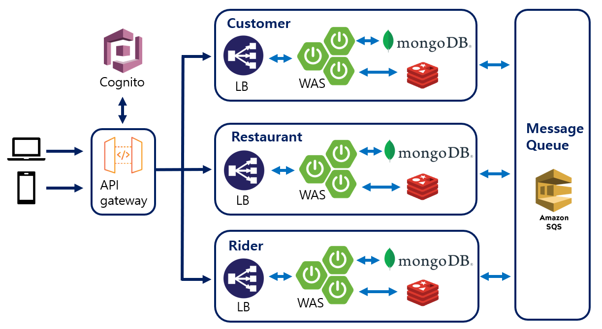

# delivery-application


## Summary
This is a toy project implementing application for food delivery system.
The server serves three type of clients (customer, restaurant, rider).
This system produces basic function of delivery system, that is ordering menu. 
If a customer sends food delivery order, the restaurant can accept or deny the order.
If the restaurant accepts the order, it can be chosen by a rider for delivery.
Order status is going to be changed according to the present situation.

For your information, this project was implemented focusing on basic ordering function.
It doesn't have any coupon, event, discount and review system. 
Don't treat this project as real app. 
Hope you treat it as reference for making delivery ordering system. 


## System structure

The whole system is consist of microservice architecture using message queue to communicate with each service.
Each service(customer, restaurant, rider) treats order information commonly, 
sending the order status to each service without being affected by responses from other services. 
That is why every service is connected by message queue.



It is assumed that this project will use API gateway such as AWS API gateway.
The API gateway is connected to user authentication service like Cognito.
The responsibility of every authentication and authorization will be taken by Cognito and API gateway.
Each service server doesn't have to consider authentication and authorization process.

## DB selection

### NoSQL

The delivery application doesn't need to use SQL database.
Changing order status is the most important part of this project and the query related to order is quite simple. 
Furthermore, there was little possibility of manipulating multiple queries at the same time, so it doesn't need transaction for each service logic. 

NoSQL write/read time is much faster than SQL, 
that is helpful to improve user experience especially for basket function.

These are why I chose NoSQL for main database. 

### MongoDB
MongoDB serves DB lock. By using it, we can block the concurrent approach the order data
when the several riders want to take same order at the same time.

## Issue #1 Why the services are configured separately and use message queue?

Each service(customer, restaurant, rider) has to work independently.
In case of real production, there would be a possibility of certain server down for some reasons.
Regardless of whether the restaurant server is working or not,
customer server should work independently to get order from customer.
while breakdown of restaurant service, the message queue hold the order information from customer service.
After quick server recovery, restaurant can get order request from message queue, 
so there is no need for customer to send request order again. 
Separation of service and using message queue is really needed for user experience.

## Issue #2  How can we show each order to rider based on its location?

How can the system shows order data for rider based on near-field area?
It is needed to show only limited order data whose store location is near current rider's location (about within 4km)
when rider uses application to check new order delivery request.

### MongoDB
MongoDB serves Geo-spatial query which returns the data based on given location parameters.
With MongoDB, the implementation to get order information close to specific region is quite simple.
We can save order data with store location by using spring "Point". 
When rider send request to get new order near rider's location,
The server use Geo-spatial query with rider location
then MongoDB return the order information whose store location is near rider location.
This is another reason why I chose MongoDB as main Database.

So, all logic to get order information based on location is processed by MongoDB.
But I will implement service logic to get order information near rider's location without MongoDB later

## Issue #3 How can we get latitude and longitude?

To use MongoDB Geo-spatial query, we should use point class of spring framework.
Point class is simple. It has two properties, latitude and longitude.

```java
public class Point implements Serializable {

    private final double x;
    private final double y;

    public Point(double x, double y) {
        this.x = x;
        this.y = y;
    }
}
```

The problem is the system don't have the latitude and longitude information of clients.
There is no b2c application in the world that requires the client to put their latitude and longitude information.

The solution was quite simple: using well-known location api. 
I chose Kakao developer API to convert address to latitude and longitude.
This api works flexibly. It treats "서울", "서울시" and "서울특별시" as same information.
Those words mean really same but have different notation because of Korean grammar.

https://developers.kakao.com/docs/latest/ko/local/dev-guide

## Issue #4 How can client get order status update in real time while using app?

The clients(customer, restaurant and rider) should get real time update notification of order status change while they are using app.

There are two options to implement real time update notification.
First is web-socket, second is server-sent-event. 
It is shown that the performance of two technologies is quite similar by according to experimental research:

>The performance difference identified between Websockets and SSE is too small to be analyzed. The
differences could be a result of measurement inaccuracies. In theory, the overhead data would not
increase with payload size for SSE while it should do that for Websockets. Smaller payloads however
allow Websockets to send slightly less overhead than SSE. The difference is only a few bytes so a very
high client amount would be needed for this to possibly be measured and compared. These differences
are situational and it is concluded that identifying one of them as more performance efficient than the
other is not doable.

http://www.diva-portal.se/smash/get/diva2:1133465/FULLTEXT01.pdf

I chose server-sent-event because I thought SSE is more appropriate solution for this matter.
Notification function needs one directional transmission (server -> client).
It doesn't need bidirectional transmission. 
SSE data is sent over HTTP. It doesn't need custom protocol.
It is more simple to implement than websocket.

### SSE Implementation

SSE emitter is included in spring web library.
This is how server side SSE is implemented in java code.

- controller

```java

    @GetMapping("/{orderId}")
    @ResponseStatus(HttpStatus.OK)
    public SseEmitter showOrderInfo(@RequestAttribute("cognitoUsername") String customerId,
                                    @PathVariable String orderId){
        SseEmitter sseEmitter = sseService.connect(customerId);
        sseService.showOrder(customerId, orderId);
        return sseEmitter;
    }

```

- service

```java

    ConcurrentHashMap<String, SseEmitter> emitterList = new ConcurrentHashMap<>();

    public SseEmitter connect(String customerId) {
        SseEmitter emitter = new SseEmitter();
        emitterList.put(customerId, emitter);
        log.info("new emitter created: {}", emitter);
        emitter.onCompletion(() -> {
            emitterList.remove(emitter);
            log.info("emitter deleted: {}", emitter);
        });
        emitter.onTimeout(emitter::complete);
        try{
            emitter.send(SseEmitter.event().name("connect").data("connected"));
        } catch (IOException e){
            throw new RuntimeException(e);
        }
        return emitter;
    }

```

When client send the request, 
the server creates sse emitter and store it in server hashmap
to use it for a follow-up request.

showOrder method finds the emitter saved in server hashmap 
and uses it to send data by using SSE.


