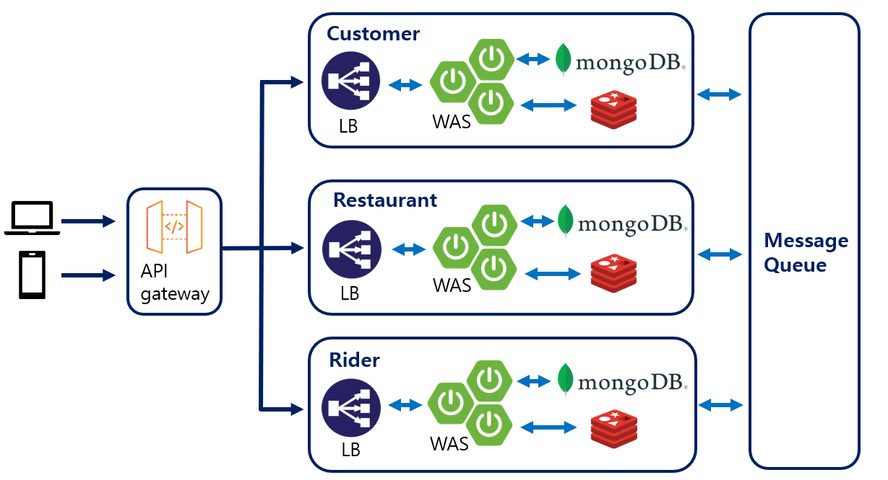

# delivery-application

## Summary
This is a toy project implementing application for food delivery system.
The server serves three type of clients (customer, restaurant, rider).
This system produces basic function of delivery system, that is ordering menu. 
If a customer sends food delivery order, the restaurant can accept or deny the order.
If the restaurant accepts the order, it can be chosen by a rider for delivery.
Order status is going to be changed according to the present situation.

For your information, this project was implemented focusing on basic ordering function.
It doesn't have any coupon, event, discount and review system. 
Don't treat this project as real app. 
Hope you treat it as reference for making delivery ordering system. 

## System structure

The whole system is consist of microservice architecture using message queue to communicate with each service.
Each service(customer, restaurant, rider) treats order information commonly, 
sending the order status to each service without being affected by responses from other services. 
That is why every service is connected by message queue.

